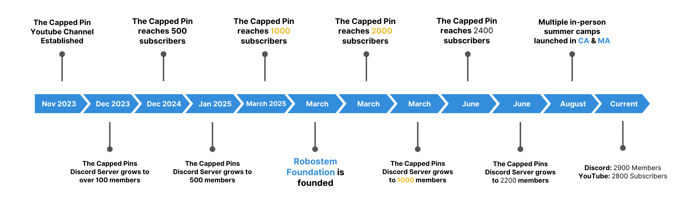

# Welcome!

## What is RoboSTEM?
[RoboSTEM](https://robostem.org) is a 501(c)(3) nonprofit organization, run completely by students. In an ever-changing world, we empower the next generation to rise and create through the power of robotics, engineering, and STEM. 

## About Us
We are a group of high schoolers and middle schoolers with a passion for robotics and education. RoboSTEM began as a small group helping each other on Discord, and grew to a YouTube channel with over 3,800 subscribers. Since then, we’ve grown into a nationwide network (CA & MA) offering workshops and coaching, all led by young creators.

## How we got here

## Getting started with VEX IQ?

Our goal with the RoboSTEM is to provide every VEX IQ team, regardless of their skill level, the resources that they need to grow their robotics knowledge.

[This wiki](https://wiki.robostem.org/) was created as an extention to [the capped pin](https://www.youtube.com/@thecappedpin) YouTube channel, however, we hope to grow it into a vast knowledge base for everything VEX IQ.

### Where can I find more resources?
  * **[YouTube Channel](https://www.youtube.com/@thecappedpin):** The Capped Pin
  * **[Discord Server](https://discord.gg/cappedpins):** The Capped Pins

## Contacts
### For Schools & Adults
contact@robostem.org
### For Students
outreach@robostem.org
## Interested in Volunteering?
- Make a real impact, creating a positive change in the community
- Get valid volunteer hours from a 501(c)(3) nonprofit.
- Gain valuable expierence in teamwork, leadership, and more

(Only for 13+)

## Sign Up [Here](https://forms.gle/2eXxDtorRYrH6CWT7)
## [FAQ](https://robostem.org/contact/#FAQS)